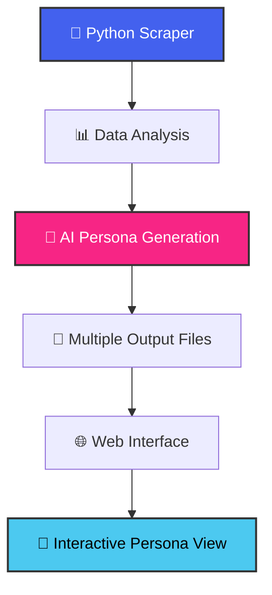

# 🎭 Reddit Persona Generator

<div align="center">


<h3>🔥 Transform Reddit Users into Detailed UX Personas with AI Magic ✨</h3>

<p><em>A comprehensive tool for analyzing Reddit user profiles and generating detailed UX personas with a beautiful web interface</em></p>

<p>
<a href="#-features"><strong>🌟 Features</strong></a> •
<a href="#-installation"><strong>⚡ Quick Start</strong></a> •
<a href="#-usage"><strong>📖 Usage</strong></a> •
<a href="#-examples"><strong>🎨 Examples</strong></a> •
<a href="#-contributing"><strong>🤝 Contributing</strong></a>
</p>

</div>

---

## 🌟 Features

<table>
<tr>
<td width="50%">

### 🔍 **Advanced Data Analysis**
- 📊 **Comprehensive User Scraping** - Posts, comments, karma, account age
- ⏰ **Activity Pattern Analysis** - Posting times, subreddit preferences  
- 🧠 **Content Analysis** - Age indicators, location hints, occupation clues
- 🎯 **Personality Trait Extraction** - MBTI-style personality assessment
- 🔄 **Behavioral Pattern Recognition** - Habits, frustrations, goals

</td>
<td width="50%">

### 🤖 **AI-Powered Generation**
- 🧬 **GPT-4 Integration** - Intelligent persona creation from raw data
- 📈 **Evidence-Based Insights** - All conclusions backed by actual behavior
- 👤 **Comprehensive Profiles** - Demographics, motivations, personality traits
- 📋 **Multiple Output Formats** - JSON data, text personas, statistics

</td>
</tr>
</table>

<div align="center">

### 🎨 **Beautiful Web Interface**


</div>

---

## 🏗️ Project Architecture

<div align="center">



</div>


## ⚡ Quick Start

<div align="center">

### 🚀 **Get Started in 3 Easy Steps!**

</div>

<table>
<tr>
<td align="center" width="33%">


```bash
git clone https://github.com/Priya-Rathor/reddit-persona-generator.git
cd reddit-persona-generator
pip install -r requirements.txt
```

</td>
<td align="center" width="33%">


```python
# Edit main.py
REDDIT_CLIENT_ID = "your_id"
REDDIT_CLIENT_SECRET = "your_secret"
OPENAI_API_KEY = "your_key"
```

</td>
<td align="center" width="33%">


```bash
python main.py
# Open index.html
# Upload generated files
```

</td>
</tr>
</table>

---

## 🎯 Usage

<div align="center">

### 🔥 **Powerful Analysis Pipeline**

</div>

<table>
<tr>
<td width="50%">

#### 1️⃣ **Generate Personas**
```bash
python main.py
```

**✨ What happens:**
- 🔍 Scrapes Reddit user profiles
- 📊 Analyzes posting patterns & content
- 🤖 Generates AI-powered personas with GPT-4
- 💾 Saves multiple output files per user

</td>
<td width="50%">

#### 2️⃣ **Visualize Results**
```bash
# Open index.html in browser
```

**🎨 Features:**
- 📁 Drag-and-drop file upload
- 🎭 Interactive persona visualization
- 📱 Mobile-responsive design
- ✨ Smooth animations & transitions

</td>
</tr>
</table>

---

## 📊 Output Showcase

<div align="center">

### 🎭 **Generated Persona Example**

</div>

<details>
<summary><strong>👤 Click to see sample persona output</strong></summary>

```
🎭 USER PERSONA: TechEnthusiast2024
👤 Age: 28
💼 Occupation: Software Developer
📍 Location: San Francisco, CA
💕 Status: Single
🎯 Tier: Early Adopter
🏷️ Archetype: The Innovator

📈 MOTIVATIONS (1-10 scale):
- ⚡ Convenience: 9 - Values efficient, streamlined solutions
- 🏃 Speed: 8 - Appreciates quick results and fast performance
- 🧠 Learning: 9 - Constantly seeking new knowledge and skills
- 🤝 Community: 7 - Enjoys collaborative environments

🧬 PERSONALITY TRAITS (MBTI-style):
- 🤫 Introversion ↔ Extroversion: 6/10 - Balanced social energy
- 🔮 Intuition ↔ Sensing: 8/10 - Big picture thinker
- 💭 Thinking ↔ Feeling: 7/10 - Logic-driven decisions
- 🎯 Judging ↔ Perceiving: 6/10 - Structured but flexible

🎯 BEHAVIOR & HABITS:
- 🌙 Most active during evening hours (7-11 PM)
- 💬 Prefers detailed, technical discussions
- 🏅 Frequently helps others with coding problems
- 📚 Shares learning resources and tutorials

😤 FRUSTRATIONS:
- 🐌 Slow or inefficient software tools
- 📖 Poor documentation and unclear instructions
- 🔄 Repetitive, manual processes

🎯 GOALS & NEEDS:
- 🚀 Stay current with emerging technologies
- 🏗️ Build innovative side projects
- 🌐 Contribute to open-source community
- 💰 Advance career in tech leadership

💬 QUOTE:
"I just want tools that work reliably without requiring a PhD to operate."
```

</details>

---

## 🛠️ Configuration

<div align="center">

### ⚙️ **Customization Options**

</div>

<table>
<tr>
<td width="50%">

#### 📊 **Scraping Limits**
```python
# Adjust data collection amount
user_data = scraper.scrape_user_profile(
    username, 
    limit=100  # Increase for more data
)
```

</td>
<td width="50%">

#### 🎯 **Target Users**
```python
# Edit profile_urls in main.py
profile_urls = [
    "https://www.reddit.com/user/username1/",
    "https://www.reddit.com/user/username2/",
    # Add more users here
]
```

</td>
</tr>
</table>

---

## 🚨 Ethics & Best Practices

<div align="center">


</div>

- ✅ **Respect Rate Limits** - Built-in delays prevent API abuse
- ✅ **Public Data Only** - Analyze only publicly available profiles
- ✅ **Privacy Conscious** - Don't store sensitive personal information
- ✅ **Terms Compliant** - Follow Reddit's Terms of Service

---

## 🤝 Contributing

<div align="center">

### 🌟 **Join Our Community of Contributors!**


</div>

```bash
# 1. Fork the repository
git fork https://github.com/Priya-Rathor/reddit-persona-generator.git

# 2. Create feature branch
git checkout -b feature/amazing-feature

# 3. Commit changes
git commit -m '✨ Add amazing feature'

# 4. Push and create PR
git push origin feature/amazing-feature
```

## 🙏 Acknowledgments

<div align="center">

<table>
<tr>
<td align="center" width="25%">

<br><em>Reddit API Access</em>
</td>
<td align="center" width="25%">

<br><em>AI Persona Generation</em>
</td>
<td align="center" width="25%">

<br><em>Beautiful UI/UX</em>
</td>
<td align="center" width="25%">

<br><em>User Contributions</em>
</td>
</tr>
</table>

</div>

---

<div align="center">


---

### 🌟 **Love this project? Give it a star!** ⭐


**Made with ❤️ by Priya Rathor**

</div>
